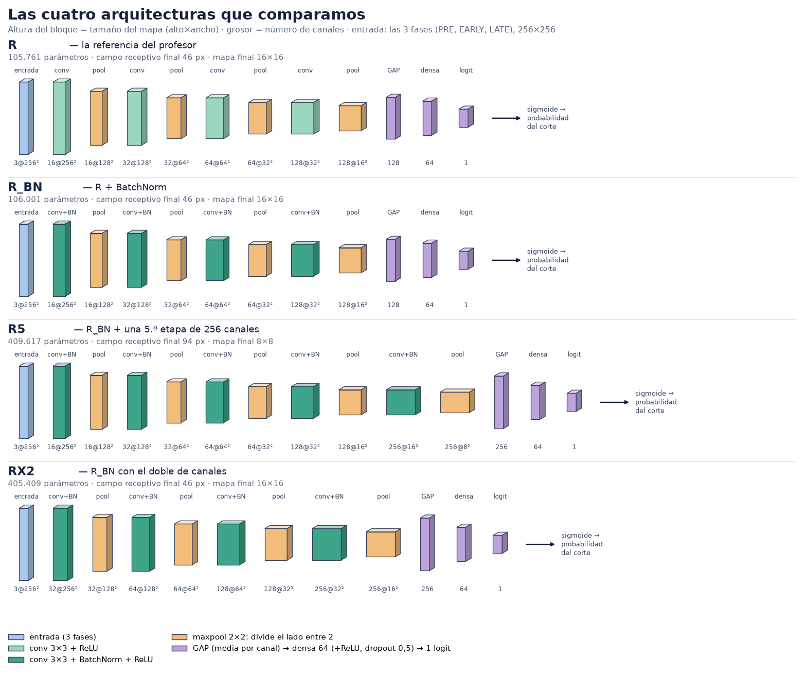

# Las cuatro redes que comparamos, explicadas

Todas las cifras de este documento están calculadas con código sobre las redes
reales (`modelos.py`), no copiadas de ninguna parte. **Todavía no sabemos cuál
ganará:** eso lo decide la criba (AUC por paciente en validación interna).

---

## 1. La idea en 30 segundos

Entra un corte de resonancia: **3 imágenes de 256×256** (PRE, EARLY, LATE) apiladas
como 3 canales. La red lo va "encogiendo" por etapas. En cada etapa:

1. una **convolución** busca patrones locales (bordes, texturas, zonas que captan
   contraste) y saca varios mapas, uno por patrón;
2. un **maxpool** reduce el mapa a la mitad de alto y de ancho.

Según se encoge el mapa, **suben los canales** (16 → 32 → 64 → 128): hay menos
posiciones pero más tipos de patrón. Al final, una **media global** (GAP) resume cada
canal en un solo número, una capa **densa** combina esos números, y sale **un único
valor** (logit) que la sigmoide convierte en la probabilidad de pCR **de ese corte**.
Luego se juntan los ~10 cortes de cada paciente para obtener la probabilidad de la
paciente.

---

## 2. ¿Por qué convolución y no una red densa?

- La entrada tiene 3×256×256 = **196.608 valores**. Una sola capa densa de 1.000
  neuronas necesitaría **196.608.000 pesos**: inviable con ~878 pacientes, y se
  sobreajustaría al instante.
- La primera convolución de nuestras redes (3→16 filtros de 3×3) tiene **448
  parámetros**. Pocos porque un mismo filtro pequeño se **reutiliza en todas las
  posiciones** de la imagen (*pesos compartidos*).
- Lo que buscamos (bordes del tumor, textura, heterogeneidad del realce) es
  **local** y puede aparecer en cualquier sitio del recorte. Un filtro que detecta un
  patrón lo detecta esté donde esté; una red densa tendría que aprender lo mismo en
  cada posición por separado.
- Las capas se **componen**: bordes → texturas → formas. Cada capa trabaja sobre lo
  que ha detectado la anterior.

### Lo específico de este problema: las 3 fases

Los 3 canales **no son colores**, son tres instantes. El primer filtro mira los tres a
la vez en cada píxel, así que puede aprender combinaciones como "EARLY − PRE", que es
justo el realce de contraste (la señal del problema). Por eso el primer filtro tiene
`in_channels=3`, y por eso el aumentado de datos se aplica al tensor entero, nunca a
una fase sola: desalinearlas destruiría esa diferencia.

---

## 3. ¿Por qué pooling?

El maxpool 2×2 se queda con el valor más alto de cada ventana y descarta el resto.
Se hace a propósito, por tres razones:

- **Menos cálculo y menos memoria:** cada pool divide el mapa por 4 (256² → 128² → …).
- **Más campo receptivo:** el *campo receptivo* es cuánta imagen original "ve" una
  neurona. Crece con la profundidad, y el pooling lo hace crecer mucho más rápido.
- **Tolerancia a pequeños desplazamientos:** si un patrón se mueve unos píxeles, el
  máximo de la ventana casi no cambia.

El precio: se pierde detalle fino de posición. Hay una alternativa (convolución con
stride 2, que *aprende* cómo reducir); nosotros mantenemos maxpool porque es lo que
usa la arquitectura de referencia, y queda como opción abierta.

**Regla de los apuntes que seguimos:** cada vez que el mapa se divide entre 2, los
canales se duplican, para que el coste de cada etapa se mantenga parecido.

---

## 4. La cabeza: GAP + densa + dropout + 1 logit

- **GAP (media global):** convierte cada canal en un número. Con un `Flatten` la capa
  densa recibiría 128×16×16 = 32.768 valores y solo esa capa tendría **2.097.216**
  parámetros; con GAP recibe 128 y tiene **8.256**. Menos parámetros, menos
  sobreajuste, y además no depende de la posición exacta.
- **Densa de 64 + ReLU:** combina los patrones detectados. (La ReLU es decisión
  nuestra: la diapositiva no la indica y, sin ella, densa + salida serían una sola
  capa lineal.)
- **Dropout 0,5:** durante el entrenamiento apaga al azar la mitad de esas 64 neuronas,
  para que la red no dependa de ninguna. En `model.eval()` se desactiva.
- **1 logit:** el caso exige una única salida. La sigmoide solo se aplica al evaluar;
  el entrenamiento usa `BCEWithLogitsLoss`, que ya la incluye.

---

## 5. Las cuatro redes

| | **R** | **R_BN** | **R5** | **RX2** |
|---|---|---|---|---|
| Qué es | La referencia del profesor | R + BatchNorm | R_BN + 5.ª etapa | R_BN con el doble de canales |
| Canales por etapa | 16-32-64-128 | 16-32-64-128 | 16-32-64-128-256 | 32-64-128-256 |
| BatchNorm | no | sí | sí | sí |
| Parámetros | 105.761 | 106.001 | 409.617 | 405.409 |
| Campo receptivo final | 46 px (18 % del lado) | 46 px | 94 px (37 % del lado) | 46 px |
| Mapa final | 16×16 | 16×16 | 8×8 | 16×16 |
| Cálculo por corte (aprox.) | 255 M | 255 M | 330 M | 963 M |

### R — la referencia
- **Fuerte:** es el punto de partida del profesor; muy pequeña (unos 120 parámetros por
  paciente de entrenamiento), así que el riesgo de sobreajustar es bajo. Rápida.
- **Débil:** sin BatchNorm puede entrenar más lento o ser sensible al *learning rate*.
  Su campo receptivo (46 px) es corto: cada neurona final ve solo el 18 % del lado.

### R_BN — R + BatchNorm
- **Qué cambia:** tras cada convolución, BatchNorm reescala cada canal (media 0,
  varianza 1 dentro del lote) y luego lo reajusta con dos parámetros aprendidos.
  Cuesta solo 240 parámetros más.
- **Fuerte:** entrenamiento más estable y normalmente más rápido; tolera mejor el
  *learning rate*. Es el bloque canónico de los apuntes (Conv → BN → ReLU).
- **Débil:** depende de las estadísticas del lote (batch 32, suficiente); en
  inferencia usa medias acumuladas, así que **hay que usar `model.eval()`**, sobre
  todo en la app. Mismo campo receptivo corto que R.

### R5 — una etapa más
- **Qué cambia:** un 5.º bloque de 256 canales. El mapa final pasa a 8×8 y el campo
  receptivo se duplica (94 px, el 37 % del lado).
- **Fuerte:** ve más contexto de cada vez: forma global de la lesión y su entorno, no
  solo textura local.
- **Débil:** casi **4 veces más parámetros**, y el 72 % está en esa última convolución
  (128→256). Más riesgo de sobreajuste con ~878 pacientes.

### RX2 — el doble de canales
- **Qué cambia:** cada etapa tiene el doble de filtros (32-64-128-256), sin añadir
  etapas. El campo receptivo no cambia (46 px).
- **Fuerte:** más tipos de patrón por escala (más capacidad), con la misma profundidad.
- **Débil:** casi 4 veces más parámetros y cerca de **4 veces más cálculo que R** (963 M
  frente a 255 M): al duplicar los canales de entrada *y* de salida de cada
  convolución, cada una cuesta 4 veces más.

---

## 6. Cómo se comparan entre sí (qué comparación es limpia)

Cada red cambia **una cosa** respecto a la anterior, salvo una excepción:

- **R vs R_BN:** limpia. Solo cambia BatchNorm (mismos parámetros casi exactos).
  Responde: *¿ayuda BatchNorm?*
- **R_BN vs R5:** **no es del todo limpia**: R5 cambia a la vez el campo receptivo y
  la capacidad (4× parámetros). Si gana, no sabremos cuál de las dos cosas ayudó.
- **R5 vs RX2:** **limpia y es la más informativa.** Tienen casi los mismos parámetros
  (~410 K) pero reparten la capacidad de forma distinta: R5 en ver **más contexto**,
  RX2 en **más filtros**. Responde: *¿le falta a la red ver más imagen, o tener más
  detectores?*

Cómo decidimos: entrenamos todas igual (mismo optimizador, semilla, parada…) y
comparamos el **AUC por paciente en validación interna**, nunca el de test. Con un solo
fold (219 pacientes) el AUC tiene un margen de unos ±0,08, así que diferencias
pequeñas serían ruido; por eso las 2 mejores se confirman en los 5 folds (margen ±0,04).

---

## 7. Preguntas que te pueden hacer, con respuesta corta

- **¿Por qué kernels 3×3?** Es el tamaño estándar: dos capas 3×3 cubren lo mismo que
  una 5×5, y tres lo que una 7×7, con menos parámetros y más no linealidades.
- **¿Por qué duplicar canales al reducir el mapa?** Menos posiciones, más tipos de
  patrón; el coste por etapa queda parecido.
- **¿Por qué GAP en vez de Flatten?** Miles de parámetros menos, menos sobreajuste,
  y no depende de la posición exacta.
- **¿Por qué un solo logit y no dos salidas?** Es clasificación binaria (pCR sí/no) y el
  caso lo exige; con `BCEWithLogitsLoss` la sigmoide va incluida.
- **¿Por qué no usar una ResNet preentrenada?** El caso lo prohíbe (sin transfer
  learning ni arquitecturas de catálogo), y con 3 canales que son fases temporales, no
  colores, los pesos de ImageNet no tendrían sentido.
- **¿Por qué la red puntúa cortes y se evalúa por paciente?** La etiqueta es de la
  paciente; sus ~10 cortes comparten etiqueta, así que se agregan.

---

## 8. Lo que aún no sabemos

- Cuál de las cuatro rinde mejor (la criba está en marcha).
- Si BatchNorm ayuda de verdad aquí, o si el problema es tan difícil que ninguna
  diferencia de arquitectura se distingue del ruido. Predecir pCR antes del
  tratamiento es difícil: si el AUC se queda en torno a 0,60-0,70, es perfectamente
  posible que varias redes queden empatadas dentro del margen de error. En ese caso
  habría que decidir entre ellas con un criterio explícito (por ejemplo, la más
  pequeña) y contarlo así en el informe.
